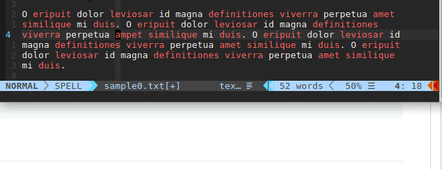
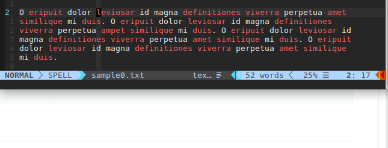
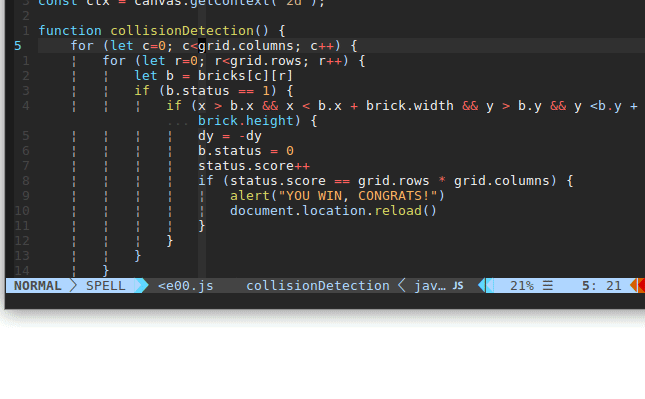
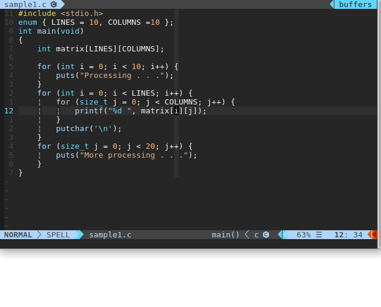
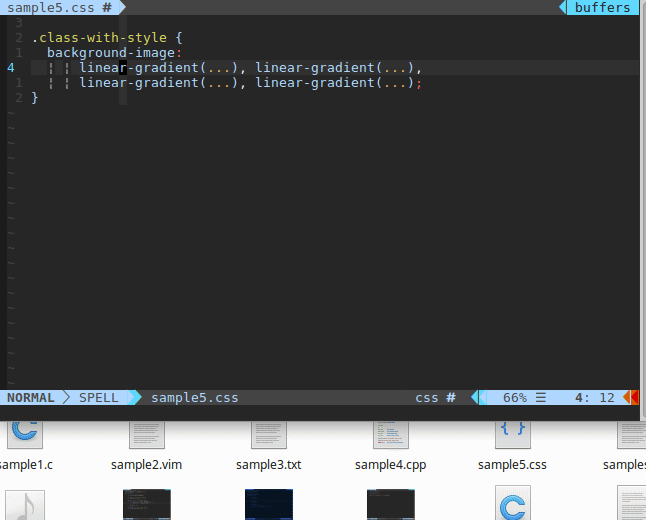

            $$$$$$$$\ $$\   $$\   $$\                               $$\
            $$  _____|$$ |  $$ |  $$ |                              $$ |
        $$\ $$ |      \$$\ $$  |$$$$$$\    $$$$$$\  $$$$$$$\   $$$$$$$ |
        \__|$$$$$\     \$$$$  / \_$$  _|  $$  __$$\ $$  __$$\ $$  __$$ |
            $$  __|    $$  $$<    $$ |    $$$$$$$$ |$$ |  $$ |$$ /  $$ |
        $$\ $$ |      $$  /\$$\   $$ |$$\ $$   ____|$$ |  $$ |$$ |  $$ |
        \__|$$$$$$$$\ $$ /  $$ |  \$$$$  |\$$$$$$$\ $$ |  $$ |\$$$$$$$ |
            \________|\__|  \__|   \____/  \_______|\__|  \__| \_______|
                   When the Ex commands evolve into operators
                   __________________________________________

We all like operators. We can use a single text object, i.e., "ap" (around
paragraph) to compose commands that delete, copy or indent just the text in
that paragraph. But, what about the ex commands? These obligate us to first
select the text just to have to write the full command after that.

How to fix that? With this plugin that has operators as **<<Leader>>s** that wrap
the functionality of Ex commands (in this case, :substitute). New when you
ever need to replace "leviosar" for "leviosa" in a while paragraph you can
just:

    <Leader>sapleviosar<Enter>leviosa<Enter>

Or you can take advantage of the cursor position to insert the word under with
the operator <Leader>sw and the command line object insertion <C-r><C-w>:

    <Leader>swap<Enter><C-r><C-w><C-h><Enter>

You may even want to add a colon to all the lines not containing brackets,
which you can do with:

    <Leader>va{{\|}<Enter>norm A;

Installation
------------------------------------------------------------------------------

Pathogen:

    cd ~/.vim/bundle
    git clone https://github.com/saulaxel/EXtend.vim'

Other plugin managers:

Add the plugin 'saulaxel/EXtend.vim' with the way specified in the
plugin manager. Example:

    Plug 'saulaxel/EXtend.vim'

Showcase
------------------------------------------------------------------------------

------------------------------------------------------------------------------
vim:tw=78:et:spell:spl=en
